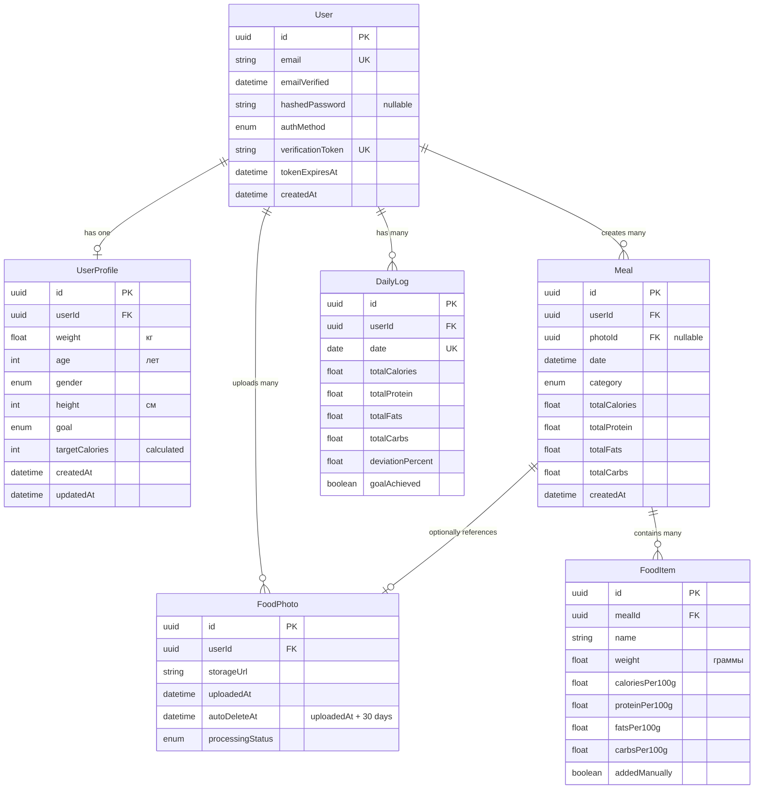

# Data Model: Трекер Калорий по Фотографии

**Date**: 2025-11-03
**Phase**: 1 (Design)
**Source**: [spec.md](./spec.md) entities + [research.md](./research.md) technical decisions

This document defines the complete data model for the application, including all entities, fields, relationships, and validation rules.

---

## Entity Relationship Diagram



---

## Entity Definitions

### 1. User

**Purpose**: Registered user of the application (Spec §Key Entities: Пользователь)

**Table**: `users`

| Field | Type | Constraints | Description | Spec Reference |
|-------|------|-------------|-------------|----------------|
| `id` | UUID | PRIMARY KEY | Unique user identifier | - |
| `email` | String | UNIQUE, NOT NULL | User email address | §FR-002 |
| `emailVerified` | DateTime | NULLABLE | Timestamp of email verification | §FR-004 |
| `hashedPassword` | String | NULLABLE | bcrypt hash (null for Google OAuth) | §FR-002a, Clarifications |
| `authMethod` | AuthMethod | NOT NULL | Authentication method used | §FR-001, §FR-002 |
| `verificationToken` | String | UNIQUE, NULLABLE | UUID for email verification | §FR-003a, Clarifications |
| `tokenExpiresAt` | DateTime | NULLABLE | Token expiration (24h from generation) | §FR-003a, Clarifications |
| `createdAt` | DateTime | DEFAULT NOW | Account creation timestamp | - |

**Enum: AuthMethod**
```typescript
enum AuthMethod {
  GOOGLE          // Google OAuth authentication
  EMAIL_PASSWORD  // Email + password authentication
}
```

**Relationships**:
- `profile`: One-to-one with `UserProfile` (nullable)
- `photos`: One-to-many with `FoodPhoto`
- `meals`: One-to-many with `Meal`
- `dailyLogs`: One-to-many with `DailyLog`

**Validation Rules**:
- `email`: Valid email format (RFC 5322)
- `hashedPassword`: bcrypt hash with salt (if authMethod = EMAIL_PASSWORD) (§FR-002a)
- `verificationToken`: UUID v4 format
- `tokenExpiresAt`: Must be createdAt + 24 hours (§FR-003a)

**Business Rules**:
- User cannot login until `emailVerified` is set (for EMAIL_PASSWORD auth) (§FR-004)
- Google OAuth users have `hashedPassword` = null
- Verification token must be unique and expires after 24 hours (Clarifications)

---

### 2. UserProfile

**Purpose**: User's personal metrics and goals (Spec §Key Entities: Профиль)

**Table**: `user_profiles`

| Field | Type | Constraints | Description | Spec Reference |
|-------|------|-------------|-------------|----------------|
| `id` | UUID | PRIMARY KEY | Unique profile identifier | - |
| `userId` | UUID | FOREIGN KEY, UNIQUE, NOT NULL | References `users.id` | - |
| `weight` | Float | NOT NULL | Weight in kilograms | §FR-015 |
| `age` | Integer | NOT NULL | Age in years | §FR-015 |
| `gender` | Gender | NOT NULL | User gender | §FR-015 |
| `height` | Integer | NOT NULL | Height in centimeters | §FR-015 |
| `goal` | GoalType | NOT NULL | User's fitness goal | §FR-016 |
| `targetCalories` | Integer | NOT NULL | Calculated daily calorie target | §FR-017 |
| `createdAt` | DateTime | DEFAULT NOW | Profile creation timestamp | - |
| `updatedAt` | DateTime | AUTO UPDATE | Last modification timestamp | - |

**Enum: Gender**
```typescript
enum Gender {
  MALE    // Мужской
  FEMALE  // Женский
}
```

**Enum: GoalType**
```typescript
enum GoalType {
  BULK          // Набор массы (+15% calorie surplus)
  MAINTAIN      // Удержание веса (maintenance calories)
  CUT           // Похудение (-15% calorie deficit)
  SUGAR_CONTROL // Контроль сахара (maintenance, carb focus)
}
```

**Relationships**:
- `user`: Many-to-one with `User` (CASCADE on delete)

**Validation Rules** (from research.md R006):
```typescript
{
  weight: { min: 30, max: 300, unit: 'kg' },
  height: { min: 100, max: 250, unit: 'cm' },
  age: { min: 10, max: 120, unit: 'years' },
}
```

**Business Rules**:
- `targetCalories` is calculated using Mifflin-St Jeor formula (research.md R006):
  ```
  BMR = (10 × weight_kg) + (6.25 × height_cm) - (5 × age) ± gender_offset
  TDEE = BMR × 1.2 (activity multiplier)
  targetCalories = TDEE × goal_multiplier
  ```
- Goal multipliers:
  - BULK: 1.15 (+15%)
  - MAINTAIN: 1.0 (maintenance)
  - CUT: 0.85 (-15%)
  - SUGAR_CONTROL: 1.0 (maintenance)
- Profile is optional (user can use app without profile, but no calorie tracking) (Spec §Edge Cases)

---

### 3. FoodPhoto

**Purpose**: Uploaded food photo with lifecycle management (Spec §Key Entities: Фотография Еды)

**Table**: `food_photos`

| Field | Type | Constraints | Description | Spec Reference |
|-------|------|-------------|-------------|----------------|
| `id` | UUID | PRIMARY KEY | Unique photo identifier | - |
| `userId` | UUID | FOREIGN KEY, NOT NULL | References `users.id` | - |
| `storageUrl` | String | NOT NULL | URL in Vercel Blob storage | §FR-005 |
| `uploadedAt` | DateTime | DEFAULT NOW | Upload timestamp | - |
| `autoDeleteAt` | DateTime | NOT NULL | Auto-deletion date (uploadedAt + 30 days) | §FR-005a, Clarifications |
| `processingStatus` | PhotoStatus | NOT NULL | Current processing state | §FR-022 |

**Enum: PhotoStatus**
```typescript
enum PhotoStatus {
  UPLOADING   // Upload in progress
  PROCESSING  // OpenRouter API analyzing
  COMPLETED   // Analysis complete, results available
  FAILED      // Processing failed (low quality, no food detected, API error)
}
```

**Relationships**:
- `user`: Many-to-one with `User` (CASCADE on delete)
- `meal`: One-to-one with `Meal` (nullable, SET NULL on photo delete)

**Validation Rules**:
- `storageUrl`: Valid HTTPS URL
- `autoDeleteAt`: Must be uploadedAt + 30 days exactly (§FR-005a)
- File size: Max 10 MB before upload (§FR-021, enforced client-side)
- File formats: JPG, PNG, HEIC (§FR-005, converted to JPG on server)

**Business Rules**:
- Photos auto-delete after 30 days via Vercel Blob lifecycle policy (§FR-005a, Clarifications)
- Deletion of photo does NOT delete associated Meal (§FR-005b, Clarifications)
- Photos can exist without associated Meal (user never saved after analysis)

---

### 4. Meal

**Purpose**: Saved meal entry with products and nutrition (Spec §Key Entities: Прием Пищи)

**Table**: `meals`

| Field | Type | Constraints | Description | Spec Reference |
|-------|------|-------------|-------------|----------------|
| `id` | UUID | PRIMARY KEY | Unique meal identifier | - |
| `userId` | UUID | FOREIGN KEY, NOT NULL | References `users.id` | - |
| `photoId` | UUID | FOREIGN KEY, UNIQUE, NULLABLE | References `food_photos.id` | - |
| `date` | DateTime | NOT NULL | Meal date and time | §FR-014 |
| `category` | MealCategory | NOT NULL | Meal type (breakfast/lunch/dinner/snack) | §FR-012, §FR-013 |
| `totalCalories` | Float | NOT NULL | Sum of all food items calories | §FR-008 |
| `totalProtein` | Float | NOT NULL | Sum of all food items protein (g) | §FR-009 |
| `totalFats` | Float | NOT NULL | Sum of all food items fats (g) | §FR-009 |
| `totalCarbs` | Float | NOT NULL | Sum of all food items carbs (g) | §FR-009 |
| `createdAt` | DateTime | DEFAULT NOW | Meal creation timestamp | - |

**Enum: MealCategory**
```typescript
enum MealCategory {
  BREAKFAST  // Завтрак (6:00-11:00 suggested)
  LUNCH      // Обед (11:00-16:00 suggested)
  DINNER     // Ужин (16:00-21:00 suggested)
  SNACK      // Перекус (other times suggested)
}
```

**Relationships**:
- `user`: Many-to-one with `User` (CASCADE on delete)
- `photo`: Many-to-one with `FoodPhoto` (SET NULL on photo delete) (§FR-005b)
- `foodItems`: One-to-many with `FoodItem` (CASCADE on delete)

**Validation Rules**:
- `totalCalories`, `totalProtein`, `totalFats`, `totalCarbs`: Must be >= 0
- Meal must have at least 1 FoodItem (Spec §Edge Cases)

**Business Rules**:
- `category` suggested based on time of day (§FR-012):
  - 6:00-11:00 → BREAKFAST
  - 11:00-16:00 → LUNCH
  - 16:00-21:00 → DINNER
  - Other times → SNACK
- User can manually override suggested category (§FR-013)
- Totals are calculated by summing FoodItem values: `(item.weight / 100) * item.[nutrient]Per100g`
- Meal persists independently of photo after deletion (§FR-005b, Clarifications)

---

### 5. FoodItem

**Purpose**: Individual food product in a meal (Spec §Key Entities: Продукт)

**Table**: `food_items`

| Field | Type | Constraints | Description | Spec Reference |
|-------|------|-------------|-------------|----------------|
| `id` | UUID | PRIMARY KEY | Unique food item identifier | - |
| `mealId` | UUID | FOREIGN KEY, NOT NULL | References `meals.id` | - |
| `name` | String | NOT NULL | Food product name (Russian) | §FR-006 |
| `weight` | Float | NOT NULL | Weight in grams or quantity | §FR-007, §FR-010 |
| `caloriesPer100g` | Float | NOT NULL | Calories per 100g | §FR-008 |
| `proteinPer100g` | Float | NOT NULL | Protein per 100g (grams) | §FR-009 |
| `fatsPer100g` | Float | NOT NULL | Fats per 100g (grams) | §FR-009 |
| `carbsPer100g` | Float | NOT NULL | Carbs per 100g (grams) | §FR-009 |
| `addedManually` | Boolean | DEFAULT FALSE | True if user added, false if API recognized | §FR-023 |

**Relationships**:
- `meal`: Many-to-one with `Meal` (CASCADE on delete)

**Validation Rules**:
- `weight`: Must be > 0 (research.md edge cases)
- `caloriesPer100g`, `proteinPer100g`, `fatsPer100g`, `carbsPer100g`: Must be >= 0
- `name`: Max 255 characters

**Business Rules**:
- Calories/protein/fats/carbs values are normalized to "per 100g" for consistency
- Actual nutrition = `(weight / 100) * [nutrient]Per100g`
- User can edit `weight` after recognition (§FR-010), triggers recalculation (§FR-011)
- If OpenRouter API fails to recognize, user adds manually (§FR-023, addedManually = true)

---

### 6. DailyLog

**Purpose**: Aggregated daily nutrition summary for calendar (Spec §Key Entities: Дневная Запись)

**Table**: `daily_logs`

| Field | Type | Constraints | Description | Spec Reference |
|-------|------|-------------|-------------|----------------|
| `id` | UUID | PRIMARY KEY | Unique daily log identifier | - |
| `userId` | UUID | FOREIGN KEY, NOT NULL | References `users.id` | - |
| `date` | Date | NOT NULL, UNIQUE | Calendar date (no time component) | §FR-018 |
| `totalCalories` | Float | NOT NULL | Sum of all meals for this day | §FR-019 |
| `totalProtein` | Float | NOT NULL | Sum of protein (g) | - |
| `totalFats` | Float | NOT NULL | Sum of fats (g) | - |
| `totalCarbs` | Float | NOT NULL | Sum of carbs (g) | - |
| `deviationPercent` | Float | NOT NULL | % deviation from targetCalories | §FR-019 |
| `goalAchieved` | Boolean | NOT NULL | True if within ±10% of target | §FR-019 |

**Relationships**:
- `user`: Many-to-one with `User` (CASCADE on delete)

**Indexes**:
- Composite index on `(userId, date)` for fast calendar queries

**Validation Rules**:
- `date`: Must be date-only format (YYYY-MM-DD), no time component
- `totalCalories`, `totalProtein`, `totalFats`, `totalCarbs`: Must be >= 0

**Business Rules**:
- DailyLog is calculated/updated whenever a Meal is created/updated/deleted for that day
- `deviationPercent` = `((totalCalories - targetCalories) / targetCalories) * 100`
- `goalAchieved` = true if `-10% <= deviationPercent <= +10%` (§FR-019)
- Used for calendar visualization (§FR-018):
  - Green color if `goalAchieved = true`
  - Gray color if `goalAchieved = false`
- Calendar loads DailyLog records for entire month (§SC-009, must be < 2s)

---

## Complete Prisma Schema

```prisma
// prisma/schema.prisma
generator client {
  provider = "prisma-client-js"
}

datasource db {
  provider = "postgresql"
  url      = env("DATABASE_URL")
}

model User {
  id                String    @id @default(uuid())
  email             String    @unique
  emailVerified     DateTime?
  hashedPassword    String?
  authMethod        AuthMethod
  verificationToken String?   @unique
  tokenExpiresAt    DateTime?
  createdAt         DateTime  @default(now())

  profile   UserProfile?
  photos    FoodPhoto[]
  meals     Meal[]
  dailyLogs DailyLog[]

  @@map("users")
}

enum AuthMethod {
  GOOGLE
  EMAIL_PASSWORD
}

model UserProfile {
  id             String   @id @default(uuid())
  userId         String   @unique
  weight         Float
  age            Int
  gender         Gender
  height         Int
  goal           GoalType
  targetCalories Int
  createdAt      DateTime @default(now())
  updatedAt      DateTime @updatedAt

  user User @relation(fields: [userId], references: [id], onDelete: Cascade)

  @@map("user_profiles")
}

enum Gender {
  MALE
  FEMALE
}

enum GoalType {
  BULK
  MAINTAIN
  CUT
  SUGAR_CONTROL
}

model FoodPhoto {
  id               String      @id @default(uuid())
  userId           String
  storageUrl       String
  uploadedAt       DateTime    @default(now())
  autoDeleteAt     DateTime
  processingStatus PhotoStatus

  user User  @relation(fields: [userId], references: [id], onDelete: Cascade)
  meal Meal?

  @@map("food_photos")
}

enum PhotoStatus {
  UPLOADING
  PROCESSING
  COMPLETED
  FAILED
}

model Meal {
  id            String       @id @default(uuid())
  userId        String
  photoId       String?      @unique
  date          DateTime
  category      MealCategory
  totalCalories Float
  totalProtein  Float
  totalFats     Float
  totalCarbs    Float
  createdAt     DateTime     @default(now())

  user      User       @relation(fields: [userId], references: [id], onDelete: Cascade)
  photo     FoodPhoto? @relation(fields: [photoId], references: [id], onDelete: SetNull)
  foodItems FoodItem[]

  @@map("meals")
}

enum MealCategory {
  BREAKFAST
  LUNCH
  DINNER
  SNACK
}

model FoodItem {
  id              String  @id @default(uuid())
  mealId          String
  name            String
  weight          Float
  caloriesPer100g Float
  proteinPer100g  Float
  fatsPer100g     Float
  carbsPer100g    Float
  addedManually   Boolean @default(false)

  meal Meal @relation(fields: [mealId], references: [id], onDelete: Cascade)

  @@map("food_items")
}

model DailyLog {
  id               String   @id @default(uuid())
  userId           String
  date             DateTime @unique @db.Date
  totalCalories    Float
  totalProtein     Float
  totalFats        Float
  totalCarbs       Float
  deviationPercent Float
  goalAchieved     Boolean

  user User @relation(fields: [userId], references: [id], onDelete: Cascade)

  @@index([userId, date])
  @@map("daily_logs")
}
```

---

## Data Access Patterns

### Common Queries

**1. User Registration & Authentication** (Spec §US1):
```typescript
// Create email/password user
await prisma.user.create({
  data: {
    email: "user@example.com",
    hashedPassword: await bcrypt.hash(password, 10),
    authMethod: "EMAIL_PASSWORD",
    verificationToken: crypto.randomUUID(),
    tokenExpiresAt: new Date(Date.now() + 24 * 60 * 60 * 1000),
  },
});

// Verify email
await prisma.user.update({
  where: { verificationToken },
  data: {
    emailVerified: new Date(),
    verificationToken: null,
    tokenExpiresAt: null,
  },
});
```

**2. Photo Upload & Analysis** (Spec §US2):
```typescript
// Create photo record
const photo = await prisma.foodPhoto.create({
  data: {
    userId,
    storageUrl: blobUrl,
    uploadedAt: new Date(),
    autoDeleteAt: new Date(Date.now() + 30 * 24 * 60 * 60 * 1000),
    processingStatus: "PROCESSING",
  },
});

// Update status after OpenRouter analysis
await prisma.foodPhoto.update({
  where: { id: photo.id },
  data: { processingStatus: "COMPLETED" },
});
```

**3. Save Meal with Food Items** (Spec §US3):
```typescript
await prisma.meal.create({
  data: {
    userId,
    photoId,
    date: new Date(),
    category: "LUNCH",
    totalCalories: 650,
    totalProtein: 45,
    totalFats: 25,
    totalCarbs: 60,
    foodItems: {
      create: [
        {
          name: "Куриная грудка",
          weight: 200,
          caloriesPer100g: 165,
          proteinPer100g: 31,
          fatsPer100g: 3.6,
          carbsPer100g: 0,
          addedManually: false,
        },
        // ... more items
      ],
    },
  },
});
```

**4. Calculate & Update Daily Log** (Spec §US5):
```typescript
// Aggregate meals for a specific day
const meals = await prisma.meal.findMany({
  where: {
    userId,
    date: {
      gte: new Date(today.setHours(0, 0, 0, 0)),
      lt: new Date(today.setHours(23, 59, 59, 999)),
    },
  },
});

const totalCalories = meals.reduce((sum, m) => sum + m.totalCalories, 0);
const deviationPercent = ((totalCalories - targetCalories) / targetCalories) * 100;

await prisma.dailyLog.upsert({
  where: { date: today },
  create: {
    userId,
    date: today,
    totalCalories,
    totalProtein: meals.reduce((sum, m) => sum + m.totalProtein, 0),
    totalFats: meals.reduce((sum, m) => sum + m.totalFats, 0),
    totalCarbs: meals.reduce((sum, m) => sum + m.totalCarbs, 0),
    deviationPercent,
    goalAchieved: Math.abs(deviationPercent) <= 10,
  },
  update: { /* same fields */ },
});
```

**5. Calendar Data Loading** (Spec §US5, §SC-009):
```typescript
// Load entire month of daily logs (must complete < 2s)
const dailyLogs = await prisma.dailyLog.findMany({
  where: {
    userId,
    date: {
      gte: startOfMonth,
      lte: endOfMonth,
    },
  },
  orderBy: { date: 'asc' },
});
```

---

## Migration Strategy

**Initial Migration**:
```bash
npx prisma migrate dev --name init
```

**Future Schema Changes**:
- Use Prisma migrations for version control
- Always create migration before deploying
- Test migrations on staging database first

---

## Data Model Status

✅ **Complete** - All entities from spec defined with full fields, relationships, and validation rules

**Traceability**:
- All entities map to Spec §Key Entities
- All fields map to Functional Requirements
- Validation rules derived from Spec + Clarifications + Research

**Next**: Generate API contracts in `contracts/` directory

---

**Data Model Version**: 1.0.0 | **Last Updated**: 2025-11-03
